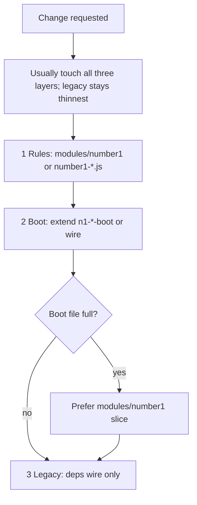

# NAF legacy-boot guard

Backlog: [docs/plans/legacy_boot_shrink_backlog.md](docs/plans/legacy_boot_shrink_backlog.md)

## Hard rules

- **Do not add logic to** `src/game/legacy-boot.js` unless orchestration only: `deps` wiring, one-line factory calls, registry entries, or closures that must close over top-level sim `let`s until the state-bag wave.
- **No cycles:** nothing under `src/game/` may import `legacy-boot.js`.
- **Before/after touching legacy-boot:** run `npm run metrics:legacy-boot` and note the `code` line count (budget ~1k code lines per backlog).
- **Pattern:** `createX(deps)` factories or pure `export function` helpers; match neighbors (e.g. `number1-black-hole.js` + `n1-black-hole-boot.js`).

## Multi-layer changes

Most features touch **all three layers** — implement in each, but **legacy stays thinnest**:

1. **Rules / constants / save shape** → `src/game/modules/number1/*.js` or domain files (e.g. `number1-black-hole.js`, `n1-ascension.js`)
2. **Behavior + DOM** → extend an existing `n1-*-boot.js` or `n1-game-loop-wire.js`
3. **legacy-boot** → pass `deps` only

## When a boot file is full

Prefer a **new slice under `modules/number1/`** over adding logic to legacy-boot. Add a new top-level `n1-*-boot.js` only if `modules/` is not viable (per backlog).

## Extraction order

1. Pure rules / math / save shape → `modules/number1/` or `number1-*.js`
2. Behavior + DOM → existing `n1-*-boot` / wire
3. legacy-boot → deps bags only

## Decision flow

## Anti-patterns

- Duplicating getters already on a controller / boot façade (e.g. black hole)
- New ascension HTML inline in legacy → `n1-ascension-pages.js` / `modules/number1/shell-panels.js`
- Importing `legacy-boot.js` from any module
- Dumping into legacy because a boot file is large — use `modules/number1/` first
