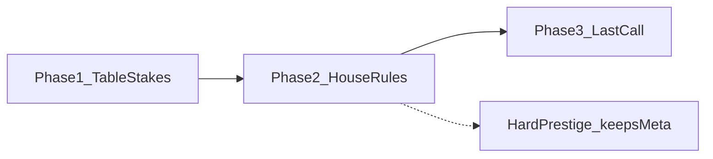

# Number 2 progression — parity plan

## What exists in the repo today (baseline for counting)

### Number 1 — approximate “feature surface”

| Bucket | Count / scale | Where it lives |
|--------|----------------|----------------|
| **Hands progression** | 10 hands; long-term objective list has **11** milestone rows (hands + Turbo unlock mixed in) | [`index.html`](c:\Numbers\NumbersareFun\index.html) `longTermObjectives` (~1316–1327), hand unlock logic |
| **Short-term objectives** | **8** rows | `objectives` (~1307–1314) |
| **Major run subsystems** | Several interacting systems (per-hand speed / cheapen / slowdown, Turbo, combos, time warp, clapping, autobuy, etc.) | Mostly [`index.html`](c:\Numbers\NumbersareFun\index.html) |
| **Ascension (meta layer 2)** | **~130** purchasable nodes (five fingers × braided graph: 12 linear + branch arms + confluence + tail per finger) | [`ascension-tree-data.js`](c:\Numbers\NumbersareFun\ascension-tree-data.js) (`expandBraidedFromFingerSeeds` → `NODES`) |
| **Ascension UX** | Full map: pan/zoom, per-branch respec, detail panel, legend | [`index.html`](c:\Numbers\NumbersareFun\index.html) `renderAscensionHub…` / ascension page |
| **Third meta layer — Black Hole (endgame)** | **Implemented:** phase-driven arc (**7** player-facing phases), state in `number1BlackHoleState`, production multiplier hooks, ascension UI shell + styles; design and locked rules in [`BLACK_HOLE_PLAN.md`](c:\Numbers\NumbersareFun\BLACK_HOLE_PLAN.md); styling e.g. `.asc-black-hole` in [`style.css`](c:\Numbers\NumbersareFun\style.css) | [`index.html`](c:\Numbers\NumbersareFun\index.html) (`number1BlackHoleState`, `BLACK_HOLE_*` constants, phase helpers), [`BLACK_HOLE_PLAN.md`](c:\Numbers\NumbersareFun\BLACK_HOLE_PLAN.md) |

**Number 1 meta layer summary (for parity):** (1) **Run** — hands + objectives + upgrade families. (2) **Ascension** — full skill map (~130 nodes). (3) **Black Hole** — post-map arc with multiple beats, sinks, and UI takeover (see plan doc for phase list and sacrifice contracts).

### Number 2 — implemented today (tight inventory)

| Bucket | Count | Where it lives |
|--------|-------|----------------|
| **Core loop** | Dice roll → Double (×2 total) vs Nothing (reset to floor / 0); active + background roll rates | [`index.html`](c:\Numbers\NumbersareFun\index.html) `resolveNumber2Roll`, `applyNumber2RollOutcome`, `tickNumber2Background`, `runNumber2GameLoopStep` |
| **Token upgrades (distinct IDs)** | **9** | [`number2-upgrades.js`](c:\Numbers\NumbersareFun\number2-upgrades.js) `NUMBER2_UPGRADES` |
| **Purchasable tiers (sum of `maxLevel`)** | **53** across those 9 IDs | Same file |
| **Run currencies / stats** | Total (BigInt string), Luck, Boom/Bust tokens, streaks, lifetime counters, a few toggles + 2 actives (`run_the_table`, `sandbagging`) | [`index.html`](c:\Numbers\NumbersareFun\index.html) `number2State` |
| **Run milestones (UI bar)** | **3** totals (256 → 65,536 → 16,777,216) | `NUMBER_2_MILESTONES` (~666–670) |
| **Meta tree (Luck table)** | **3** nodes, linear | [`ascension2-tree-data.js`](c:\Numbers\NumbersareFun\ascension2-tree-data.js) |
| **Luck essence income** | +1 essence every **25** lifetime Doubles (no run reset) | `applyNumber2RollOutcome` (~938–940) |
| **Ascension page shell** | Tab + simple grid; copy mentions “Respec … planned” | `renderAscensionNumber2ShellHtml` (~2636–2660) |

**Interpretation:** Number 2 already has a coherent *gambling core* (boom/bust tokens, toggles, forced loss, surge). It is **an order of magnitude smaller** than Number 1 on meta content (130 vs 3 nodes) and lacks a **third-layer endgame** comparable in breadth to Number 1’s Black Hole (multi-phase arc, dedicated panel, progressive rule changes). N1 also resets the Number 1 **run** on Ascend; N2 still has **no** agreed hard prestige — aligning with your earlier choice to add **hard prestige** for N2.

---

## Step 1 of your pipeline — “how many features” (definitions we will use)

To avoid apples-to-oranges, we will count **implementation units** an AI can ship independently:

1. **F1 — Upgrade definition**: one `NUMBER2_UPGRADES` entry (or successor table) including mechanics + costs + unlock rules + UI string.
2. **F2 — Meta node**: one purchasable node in the Number 2 meta tree (with `grants`, costs, parents, copy).
3. **F3 — Progression gate / phase beat**: a discrete player-visible goal that unlocks systems, art, or narrative (not just a number tick).
4. **F4 — Prestige / reset rule**: one coherent ruleset (what resets, what persists, what is gained) — counts as one feature with many acceptance criteria.
5. **F5 — Visual / juice package**: die/table/chip motifs, outcome VFX, upgrade icons, phase banners (grouped per phase in specs).
6. **F6 — Third-phase system**: one endgame structure (minigame, sink, boss table, “final bet”, etc.) with win/loss and rewards. *Reference class:* Number 1’s Black Hole is **one** F6 umbrella with **seven** internal phase beats (count those as F3 sub-beats when estimating AI workload).

**Current totals (repo):** F1=**9**, F2=**3**, F3≈**3** (milestones only), F4=**0** (no hard prestige), F5=**partial** (stage exists; no phase-grade dressing), F6=**0** (N1 counterpart: **1** arc × **7** phases, implemented).

**Target totals (for ideation — not final until design pass):** propose bands so the next step can converge:

- **F1:** aim **+11 to +21** new upgrade IDs (landing **20–30** total) so buildcraft resembles N1’s “many knobs,” but themed around **stakes, relief, and table image** (not generic +x%).
- **F2:** aim **+25 to +127** nodes (e.g. **40–80** if you want a readable first ship; **120+** for true N1-scale). Tree layout can mirror N1’s data-driven graph or use a **casino-floor map** (distinct fantasy).
- **F3:** aim **8–15** phase beats across three phases (gates, unlocks, “the house introduces…” moments).
- **F4:** **1** hard prestige system (you selected this): e.g. “Leave the table” / “New shoe” — resets run-scale stats while keeping meta.
- **F5:** **3** visual passes aligned to phases (table stakes → house floor → endgame).
- **F6:** **1** spiky endgame system (you want **memorable gut punches** with **strong relief valves** — design explicitly pairs pain tools with outs). For **depth parity** with N1 Black Hole, plan **~5–7** major beats *inside* that system (not necessarily seven; match fun density, not astronomy).

The **delta to implement** = targets minus current (e.g. F1 delta ≈ **11–21** new upgrades). Exact numbers get locked when you approve the ideation list.

---

## Three meta layers for Number 2 (distinct from Number 1, same structural role)

Number 1’s end-to-end shape is now **run (hands + systems) → ascension map → Black Hole arc** ([`BLACK_HOLE_PLAN.md`](c:\Numbers\NumbersareFun\BLACK_HOLE_PLAN.md)). Number 2 should mirror **that depth and layering**, not the **fantasy** (no accretion disk reskin): casino/table stakes, meta “house rules,” then a **Last call** endgame with comparable beat count and clarity.

With your earlier choices (**hard prestige**, **spiky**, design N2’s own fiction), a coherent skeleton:

- **Phase 1 — Table stakes (early run):** teach Double/Nothing, token economy, first relief tools, first “house” character in copy/UI. Gates should feel like **learning the table**, not unlocking hands.
- **Phase 2 — House rules (meta):** large Luck essence tree (or multi-floor map), branches that **rewrite rules** (not just +p): side bets, dealer quirks, chip rules, insurance variants — this is where **hard prestige** earns its place (new shoes reset totals/upgrades but leave meta nodes / essence progression).
- **Phase 3 — Last call (endgame):** one **spiky** capstone system with explicit **relief** progression (e.g. bailouts earned through bust patterns, or “marker” debt that can be bought back). Treat Number 1’s Black Hole as a **scope reference** (multi-phase UI, sinks, changing rules, optional hard pivot in late phases — see plan doc), expressed in **gambling/table** language for N2.

Each phase should ship **F3 beats + F5 dressing +** a slice of **F1/F2**.

---

## Ideation → AI-ready specs (workflow you asked for)

For each candidate feature after counts are agreed:

1. **Player fantasy** (one sentence, casino/gambling lexicon).
2. **Mechanics** — inputs, outputs, edge cases, save fields, migration.
3. **Economy** — how it moves Boom/Bust/Luck/essence/total; expected spikiness; mitigation.
4. **UI/UX** — where it appears; telemetry strings; a11y.
5. **Acceptance tests** — 5–10 bullet checks an agent must pass.
6. **Dependencies** — which phase, which prestige tier, which nodes.

Primary code touchpoints for implementation agents: [`number2-upgrades.js`](c:\Numbers\NumbersareFun\number2-upgrades.js), [`ascension2-tree-data.js`](c:\Numbers\NumbersareFun\ascension2-tree-data.js), [`index.html`](c:\Numbers\NumbersareFun\index.html) (state, save/load, tick, UI), and any new assets/CSS you add alongside.

---

## Design principles (senior game-dev lens, tied to your theme)

- **Double or nothing is a contract:** every spicy downside should have a **readable** upside path (your **spiky** choice). Avoid opaque math traps.
- **Gambling theme as mechanics, not wallpaper:** upgrades should change **bets, limits, odds visibility, side pots, table position**, not “+10% abstract resource.”
- **Hard prestige must answer “why reset?”:** new shoe = new angles on the same meta tree; essence or meta currency should **unlock new rule modules**, not only numeric growth.
- **Pacing:** N2 currently gains Luck essence slowly (every 25 lifetime doubles). Any tree explosion must **re-tune income** or node costs so purchases keep up with N1’s “every few runs” feel.

---

## Open design questions (follow-up, after this plan)

These are not blocking the count framework, but answers will shape specs:

- Should Number 2’s hard prestige **require** completing a phase gate, or be always available with different payouts?
- Should **Luck essence** remain the only meta currency, or do you want a second “debt / marker / comp” currency for spiky systems?
- Target **time-to-first prestige** vs **time-to-phase-3** (rough session goals)?
- Number 1’s Black Hole starts after **owning every ascension node** ([`BLACK_HOLE_PLAN.md`](c:\Numbers\NumbersareFun\BLACK_HOLE_PLAN.md) unlock gate). Should Number 2’s **Last call** use a symmetric gate (e.g. every Luck-table node owned), a softer gate, or something thematic (e.g. “max bet unlocked”)?
